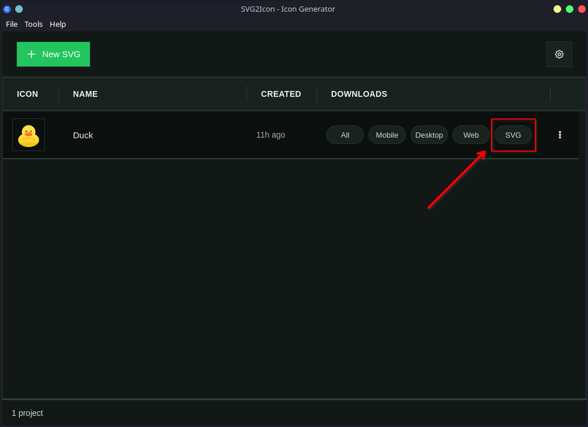

# Download Original SVG

Retrieve the exact SVG you imported into your project — unchanged.

## Where to find it
On the project row, click the “SVG” download. This creates a small ZIP that only contains your original SVG.



## What’s inside
```tree
<project> - SVG - svg2icon.zip/
└─ svg/
   └─ <project>_original.svg
```


## Notes
- The original SVG is not included in Web/Mobile/Desktop packages to keep those bundles lean and focused.
- The All‑In‑One bundle includes the same `svg/` folder shown above, alongside the other targets.
- You can re‑download the SVG anytime from the project row.
